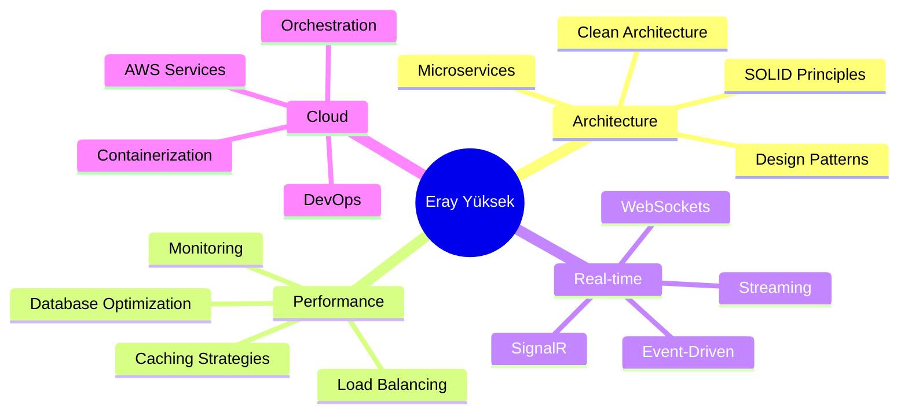

# 💫 Eray Yüksek
### `Senior Backend Architect` • `.NET Ecosystem Specialist` • `Performance Engineer`

<div align="center">

[](https://git.io/typing-svg)

</div>

---

## 🧬 **System Architecture**

```csharp
public class ErayYuksek : ISeniorDeveloper, IArchitect, IProblemSolver
{
    public string[] CoreExpertise => new[]
    {
        ".NET Core & Framework", "Microservices Architecture", 
        "Real-time Systems", "Database Optimization",
        "Cloud Engineering", "Performance Tuning"
    };
    
    public Dictionary<string, string[]> TechStack => new()
    {
        ["Backend"] = { ".NET Core", "C#", "ASP.NET Web API", "SignalR" },
        ["Database"] = { "PostgreSQL", "SQL Server", "Redis", "Entity Framework" },
        ["Cloud & Tools"] = { "AWS", "Docker", "Kubernetes", "Microservices" },
        ["Architecture"] = { "Clean Architecture", "CQRS", "Event Sourcing", "DDD" }
    };
    
    public bool CanSolve(Problem problem) => problem.Complexity <= Double.MaxValue;
}
```

---

## 🚀 **Performance Metrics**

<div align="center">

| 🔥 **Metric** | 📊 **Value** | 🎯 **Impact** |
|:---:|:---:|:---:|
| **Years of Excellence** | `5+` | Senior-level expertise |
| **Projects Delivered** | `50+` | Production-grade solutions |
| **System Uptime** | `99.9%` | Enterprise reliability |
| **Performance Boost** | `10x` | Optimization specialist |

</div>

---

## ⚡ **Current Focus Areas**

<div align="center">

```ascii
    🏗️ ARCHITECTURE        🔄 REAL-TIME           🚀 PERFORMANCE
    ┌─────────────────┐     ┌─────────────────┐     ┌─────────────────┐
    │ Microservices   │────▶│ SignalR Systems │────▶│ Optimization    │
    │ Design Patterns │     │ WebSocket APIs  │     │ Scaling         │
    │ Clean Code      │     │ Live Streaming  │     │ Monitoring      │
    └─────────────────┘     └─────────────────┘     └─────────────────┘
```

</div>

---

## 🛠️ **Technology Arsenal**

### **Backend Mastery**


### **Database & Caching**


### **Cloud & DevOps**


---

## 🎯 **Active Projects**

<details>
<summary><b>🔴 LIVE: Real-time Communication Hub</b></summary>

```yaml
Project: Advanced Chat Platform
Tech Stack: [.NET Core, SignalR, PostgreSQL, Redis]
Scale: 10,000+ concurrent users
Performance: <100ms latency
Features:
  - Real-time messaging
  - File sharing system  
  - Push notifications
  - Scalable architecture
Status: Production ✅
```
</details>

<details>
<summary><b>🟢 ACTIVE: Microservices Platform</b></summary>

```yaml
Project: Enterprise Microservices Ecosystem
Tech Stack: [.NET Core, Docker, Kubernetes, AWS]
Load: 1M+ requests/day
Uptime: 99.9%
Architecture:
  - API Gateway
  - Service Discovery
  - Event-Driven Design
  - Distributed Caching
Status: Production ✅
```
</details>

<details>
<summary><b>🟡 R&D: AI Performance Optimizer</b></summary>

```yaml
Project: ML-Powered Database Optimizer
Tech Stack: [.NET Core, Machine Learning, Performance Analytics]
Goal: Automatic bottleneck detection
Features:
  - Real-time monitoring
  - Predictive analytics
  - Auto-optimization
  - Performance insights
Status: Beta Testing 🧪
```
</details>

---

## 📈 **GitHub Analytics**

<div align="center">


</div>

---

## 🏆 **Expertise Highlights**

<div align="center">



</div>

---

## 💡 **Philosophy**

<div align="center">

> *"Code is poetry written in logic,*  
> *Architecture is the symphony that makes it sing"*

**🎯 Mission**: Building scalable, maintainable systems that solve real problems  
**⚡ Approach**: Clean code, solid architecture, continuous learning  
**🚀 Goal**: Creating technology that makes a difference  

</div>

---

## 🌟 **Learning Journey 2025**

- [ ] **Advanced SignalR Patterns** - Real-time system mastery
- [ ] **AWS Solution Architecture** - Cloud expertise expansion  
- [ ] **Kubernetes Deep Dive** - Container orchestration
- [ ] **Machine Learning Integration** - AI-powered backends
- [ ] **Performance Engineering** - Microsecond optimization

---

## 🤝 **Let's Connect & Collaborate**

<div align="center">

[](https://www.linkedin.com/in/eray-y-6a671a322/)
[](https://github.com/ErayYuksek)
[](mailto:eray@example.com)

**🇹🇷 Based in Turkey** • **🌍 Open to Global Opportunities** • **💼 Available for Consulting**

</div>

---

<div align="center">


**⭐ "Building the future, one commit at a time" ⭐**

</div>

---

<div align="center">

</div>
