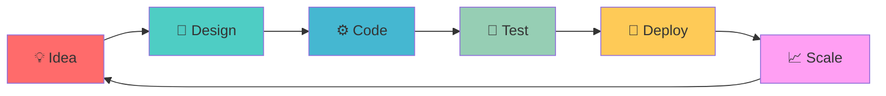

# Hi, I'm Eray Yüksek 👋

**Backend Developer** • **.NET Specialist** • **Building Scalable Applications**

<div align="center">
  
### 🎯 **Passionate about building robust, scalable solutions**

</div>

---

## 🚀 About Me

- 💼 **Backend Developer** specializing in **.NET ecosystem**
- 🌍 Based in **Turkey** 🇹🇷
- 🎯 Focused on **scalable applications** and **clean architecture**
- 📧 Open to **new opportunities** and **collaborations**

## 🛠️ Tech Stack

**Backend**
- .NET Core/Framework • C# • ASP.NET Web API
- Entity Framework • SignalR • RESTful APIs

**Database & Caching**
- PostgreSQL • SQL Server • Redis

**Tools & Platforms**
- Angular • React • Bootstrap
- AWS • Postman • Swagger/OpenAPI

## 📊 GitHub Stats

<div align="center">
  
  
</div>

<div align="center">
  
</div>

## 🎯 Current Focus

- 🔥 **Real-time Applications** with SignalR
- 🏗️ **Microservices Architecture** design
- 🗄️ **Database Optimization** and performance tuning
- ☁️ **Cloud Integration** with AWS

## 🌟 Development Showcase

<div align="center">

### 🎨 My Code Canvas
> *"Every line of code is a brushstroke on the canvas of innovation"*

**💡 Current Mission:** Building the next generation of scalable applications

### 🚀 Innovation Labs
<table width="100%">
<tr>
<td align="center" width="33%">

**⚡ Real-time Systems**  
SignalR • WebSockets  
`🔴 Live`

</td>
<td align="center" width="33%">

**🏗️ Architecture Design**  
Microservices • Clean Code  
`🟢 Active`

</td>
<td align="center" width="33%">

**🔍 Performance Lab**  
Optimization • Scaling  
`🟡 Research`

</td>
</tr>
</table>

### 🧬 Developer DNA Sequence

<div align="center">

<table>
<tr>
<td width="50%" align="center">

```css
/* Developer.css */
.eray-yuksek {
    position: absolute;
    expertise: [".NET", "C#", "APIs"];
    passion: "clean-code";
    mindset: "scalable-solutions";
    animation: continuous-learning 24/7;
}

@keyframes innovation {
    from { idea: 0%; }
    to { production: 100%; }
}

.motto::after {
    content: "Code with 💙, Build with 🧠";
    color: var(--passion-blue);
}
```

</td>
<td width="50%" align="center">


**⚡ Neural Network Architecture**



</td>
</tr>
</table>

**🌟 Code Philosophy Matrix**

```yaml
developer:
  name: "Eray Yüksek"
  class: "FullStackArchitect"
  
  skills:
    backend: [".NET Core", "C#", "SignalR"]
    database: ["PostgreSQL", "Redis", "EF Core"]
    mindset: "First make it work, then make it beautiful"
  
  principles:
    - "Every bug is a learning opportunity 🐛➡️💡"
    - "Clean code reads like well-written prose 📖"
    - "Performance matters, but clarity matters more 🎯"
  
  currentMission: |
    Building tomorrow's applications with today's best practices
    while keeping an eye on next-generation technologies 🚀
```

</div>

### ⚡ Weekly Code Stats
<div align="center">
  
  
</div>

### 🎯 Achievement Unlocked


</div>

## 💼 What I'm Working On

**🚀 Current Projects**
- Real-time chat application with file sharing
- Microservices platform with API Gateway
- Database performance optimization tools

**🎓 Learning Goals 2025**
- Advanced SignalR implementations
- AWS cloud architecture
- Docker & Kubernetes
- .NET MAUI development

## 🤝 Let's Connect

<div align="center">
  <a href="https://www.linkedin.com/in/eray-y-6a671a322/">
    
  </a>
  <a href="https://github.com/ErayYuksek">
    
  </a>
  <a href="mailto:eray@example.com">
    
  </a>
</div>

---

<div align="center">
  <strong>✨ Building the future, one commit at a time ✨</strong>
</div>
