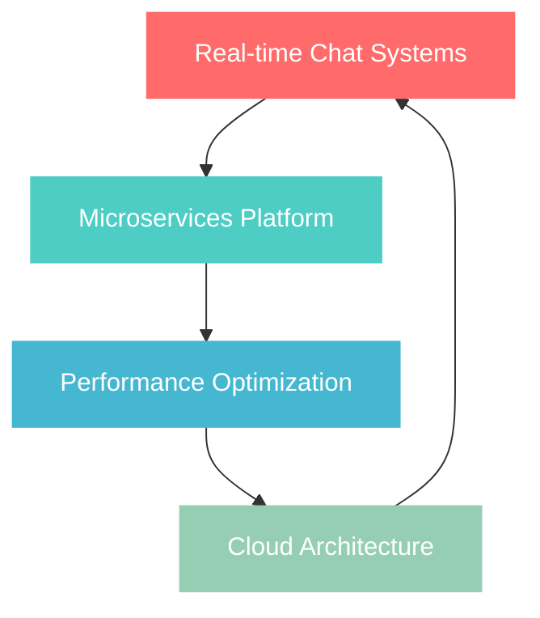

<div align="center">

# 👨‍💻 Eray Yüksek

```ascii
╔══════════════════════════════════════╗
║    Backend Architect & .NET Wizard   ║
║         🚀 Code • Scale • Innovate   ║
╚══════════════════════════════════════╝
```


[](https://github.com/ErayYuksek)
[](https://www.linkedin.com/in/eray-y-6a671a322/)
[](mailto:eray@example.com)

</div>

---

## 🎯 Mission Statement

> *"Transforming complex business requirements into elegant, scalable backend solutions that power the digital future."*

**📍 Based in Turkey** | **🎓 .NET Ecosystem Expert** | **🏗️ Architecture Enthusiast**

---

## 🛠️ Tech Arsenal

<table>
<tr>
<td valign="top" width="33%">

### 🔥 Backend Mastery
```csharp
// My daily weapons
var stack = new TechStack
{
    Language = "C#",
    Framework = ".NET Core/Framework",
    API = "ASP.NET Web API",
    ORM = "Entity Framework",
    RealTime = "SignalR"
};
```

</td>
<td valign="top" width="33%">

### 🗄️ Data & Caching
```sql
-- Database Expertise
SELECT 
    'PostgreSQL' AS Primary,
    'SQL Server' AS Enterprise,
    'Redis' AS Caching,
    'T-SQL' AS Query_Language
```

</td>
<td valign="top" width="33%">

### ☁️ Cloud & Tools
```yaml
# DevOps Pipeline
Platform: AWS
Containers: Docker
API_Testing: Postman
Documentation: Swagger/OpenAPI
Frontend: Angular, React
```

</td>
</tr>
</table>

---

## 🎨 What Makes Me Different

<div align="center">

| 🏗️ **Architecture First** | ⚡ **Performance Driven** | 🔄 **Real-time Expert** |
|:------------------------:|:-------------------------:|:------------------------:|
| Clean Architecture advocate | Database optimization guru | SignalR & WebSocket master |
| SOLID principles in practice | Scalability-focused design | Live data streaming |

</div>

---

## 🔬 Innovation Lab

<div align="center">

### 🧪 Current Experiments



</div>

---

## 📊 GitHub Analytics

<div align="center">


</div>

---

## 🎯 2025 Roadmap

<details>
<summary>🗺️ <b>Click to view my professional journey ahead</b></summary>

### Q1 2025
- [ ] Advanced SignalR Hub implementations
- [ ] AWS Lambda & Serverless architecture
- [ ] Performance benchmarking tools

### Q2 2025
- [ ] Kubernetes orchestration
- [ ] Event-driven microservices
- [ ] GraphQL integration

### Q3-Q4 2025
- [ ] AI/ML integration with .NET
- [ ] Advanced caching strategies
- [ ] Open source contribution goals

</details>

---

## 🌟 Featured Projects Showcase

<div align="center">

### 🏆 Signature Work

| Project | Tech Stack | Status |
|---------|------------|--------|
| 🚀 **Real-time Chat Platform** | SignalR • .NET Core • PostgreSQL |  |
| 🏗️ **Microservices Gateway** | ASP.NET • Docker • AWS |  |
| ⚡ **Performance Monitor** | C# • Redis • Angular |  |

</div>

---

## 🔥 GitHub Activity

<div align="center">


</div>

---

## 💡 Code Philosophy

<div align="center">

```typescript
class Developer {
    readonly name = "Eray Yüksek";
    readonly motto = "Clean Code • Scalable Solutions • Continuous Learning";
    
    private beliefs = {
        codeQuality: "Non-negotiable",
        testing: "Essential foundation", 
        documentation: "Code should tell a story",
        performance: "Speed matters"
    };
    
    public async buildAmazingThings(): Promise<Success> {
        return await this.passion
            .combineWith(this.skills)
            .executeWith(this.dedication);
    }
}
```

</div>

---

## 🎪 Fun Facts & Interests

<div align="center">

🎲 **Random.Next(aboutMe)**

| 🌙 Night Owl Coder | 🎮 Logic Puzzle Solver | ☕ Coffee += Performance |
|:------------------:|:---------------------:|:-----------------------:|
| Best code at 2 AM | Chess & strategy games | Fuel for clean code |

</div>

---

## 🤝 Let's Build Something Amazing

<div align="center">

**Ready to transform ideas into scalable reality?**

Whether you need robust backend architecture, real-time systems, or performance optimization, I'm passionate about crafting solutions that make a difference.

### 🚀 Collaboration Channels

[](https://www.linkedin.com/in/eray-y-6a671a322/)
[](https://github.com/ErayYuksek)
[](mailto:eray@example.com)

---

### ⚡ Quick Connect

```json
{
    "status": "Available for opportunities",
    "interests": ["Backend Architecture", "Real-time Systems", "Cloud Solutions"],
    "collaboration": "Open to exciting projects",
    "response_time": "< 24 hours"
}
```


</div>

---

<div align="center">

### 💫 *"Code is poetry written in logic"*

**Building tomorrow's solutions, today** 🚀

</div>
