<!-- Dynamic Header with Typing Animation -->
<div align="center">
  
</div>

<!-- Professional Banner -->
<div align="center">
  
</div>

---

## 🚀 **About Me**


```csharp
public class ErayYuksek : Developer
{
    public string[] Skills => new[] {
        "Backend Development", "API Design", 
        "Database Architecture", "System Integration"
    };
    
    public string CurrentFocus => ".NET Ecosystem";
    public bool IsAvailableForWork => true;
    public string Location => "Turkey 🇹🇷";
    
    public void SayHi() => 
        Console.WriteLine("Thanks for dropping by! Let's build something amazing together 🚀");
}
```

---

## 🛠️ **Tech Arsenal**

### **Backend & Core**
<p>
  
  
  
</p>

### **Frontend & Tools**
<p>
  
  
</p>

### **Databases & Cloud**
<p>
  
  
</p>

---

## 📊 **GitHub Analytics**

<div align="center">
  
  
</div>

<div align="center">
  
</div>

---

## 🏆 **Achievements & Activity**

<div align="center">
  
</div>

<div align="center">
  
</div>

---

## 💡 **What I'm Working On**

- 🔥 **Real-time Applications** with SignalR and Redis
- 🏗️ **Microservices Architecture** using .NET Core
- 🗄️ **Database Optimization** and Performance Tuning
- 🌐 **RESTful APIs** with comprehensive documentation
- ☁️ **Cloud Integration** with AWS services

---

## 🌟 **Recent Focus Areas**

```mermaid
mindmap
  root)Eray Yüksek(
    Backend Development
      .NET Core/8
      Web APIs
      Microservices
    Database
      PostgreSQL
      SQL Server
      Redis Caching
    Frontend
      Angular
      Bootstrap
      Responsive Design
    DevOps
      AWS
      API Documentation
      Performance Optimization
```



---

## 📫 **Let's Connect**

<div align="center">
  
[](https://www.linkedin.com/in/eray-y-6a671a322/)
[](https://github.com/ErayYuksek)
[](mailto:your-email@example.com)

</div>

---

## 💭 **Quote That Drives Me**

<div align="center">
  
</div>

---

<!-- Animated Footer -->
<div align="center">
  
</div>

<div align="center">
  
  
  **Thanks for visiting! ⭐ Star some repositories if you find them interesting!**
</div>
